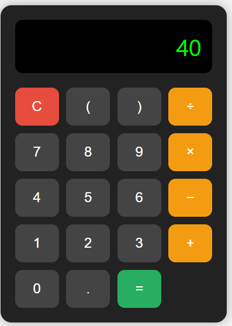

# 🔢 Simple Calculator

A clean and responsive web-based calculator built using **HTML**, **CSS**, and **JavaScript**. This project provides basic arithmetic operations and a visually appealing interface, perfect for beginners learning front-end development.

## 🚀 Features

- Responsive and modern UI
- Basic arithmetic operations: Addition, Subtraction, Multiplication, Division
- Parentheses support for expressions
- Real-time evaluation with `eval()`
- Error handling for invalid expressions
- Reset/Clear button

## 🛠️ Built With

- **HTML5** – Structure of the calculator
- **CSS3** – Styling and layout using Flexbox and Grid
- **JavaScript** – Functionality and interaction

## 📸 Screenshot



## 🎯 Usage

1. Clone the repository:
   ```bash
   git clone https://github.com/lavanyabollina/calculator.git

   
2.Navigate to the project folder:
 ```bash
    cd calculator
  ```

3.Open index.html in your browser.

## 📂 File Structure
 ```bash
calculator/
├── index.html
├── README.md
└── screenshot.png  # (Optional: Add if you want a visual preview in README)
   ```
## 📌 Example
Expression: (7+3)*2

Output: 20

---

## ⚠️ Note
This calculator uses the eval() function for expression evaluation. While this is fine for simple applications, it's not recommended in production apps due to security risks. For enhanced safety, consider using a math expression parser like math.js.

